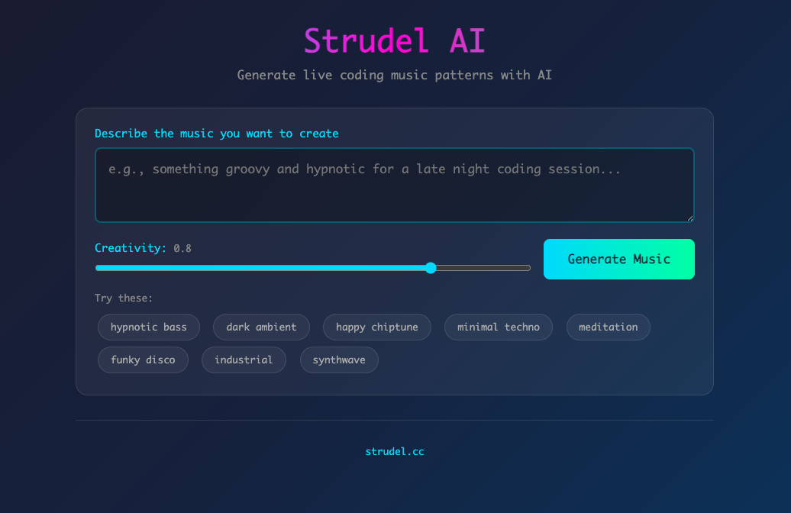

# Strudel AI

Generate [Strudel](https://strudel.cc/) live coding patterns using RAG.



## Setup

```bash
pip install -r requirements.txt
export ANTHROPIC_API_KEY=your-key-here
python app.py
```

Open http://localhost:8000

## How it Works

- **185+ curated patterns** with descriptions, moods, and tags
- **Local embeddings** via sentence-transformers (no API needed)
- **Claude** generates new code based on similar patterns

## Adding Patterns

Edit `patterns.json`. Each pattern needs: `id`, `name`, `description`, `tags`, `tempo`, `mood`, `code`.
